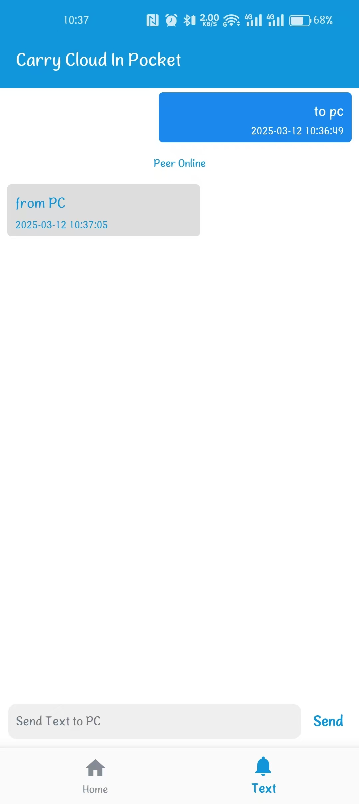

# CarryCloud
[**中文**](README.zh.md) | [**English**](README.md)

#### Introduction
1.  The app has a built-in PHP environment, supporting private cloud storage systems like kodbox or other PHP applications, ready to use out of the box.
2.  Expands the original capabilities of the kbox, allowing management of mobile files from a PC browser beyond just the cloud storage.
3.  Adds a text sharing feature, enabling login-free sharing of plain text content between mobile and PC.

#### Usage Instructions
1.  Ensure both the mobile device and PC are connected to the same local network.
2.  Keep the app running in the foreground after opening.
3.  Follow the prompts to enter the URL in the PC browser.

#### Feature Plan
1. [x]  Scan QR code to connect
2. [x]  Internet network access

#### Screenshots

App Home Page

Text Sharing on Mobile

Text Sharing on PC

Phone File Management

Custom WebApps

