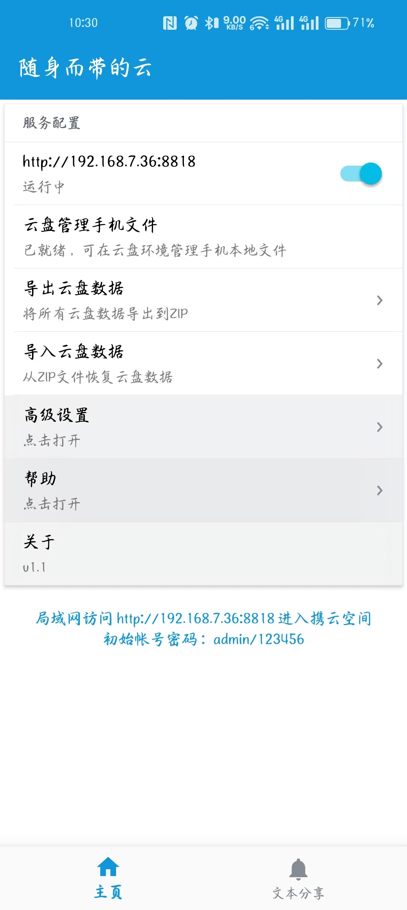
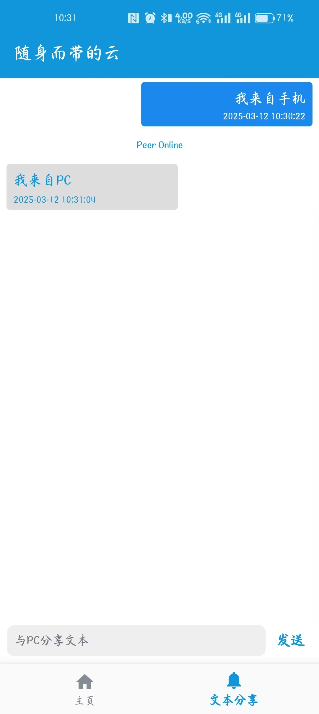
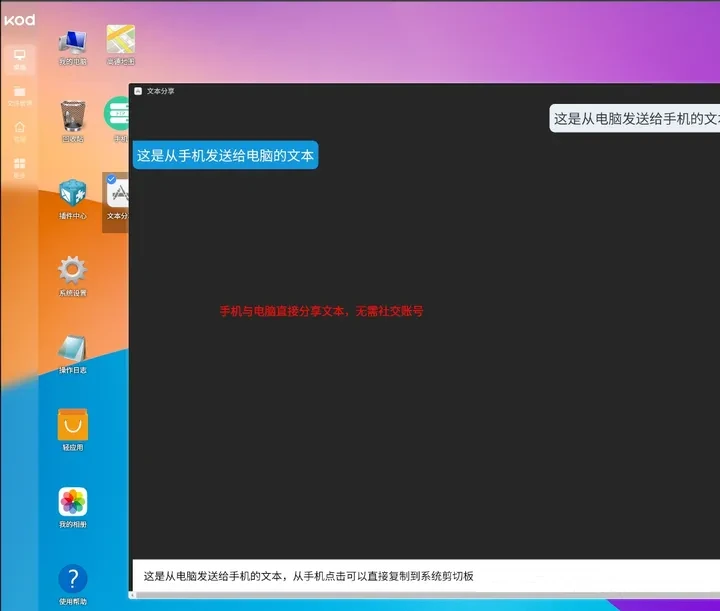
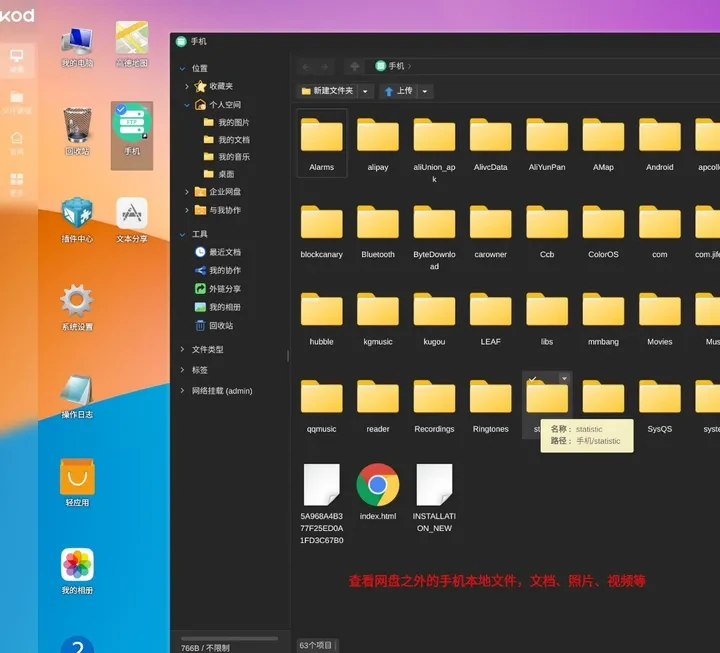
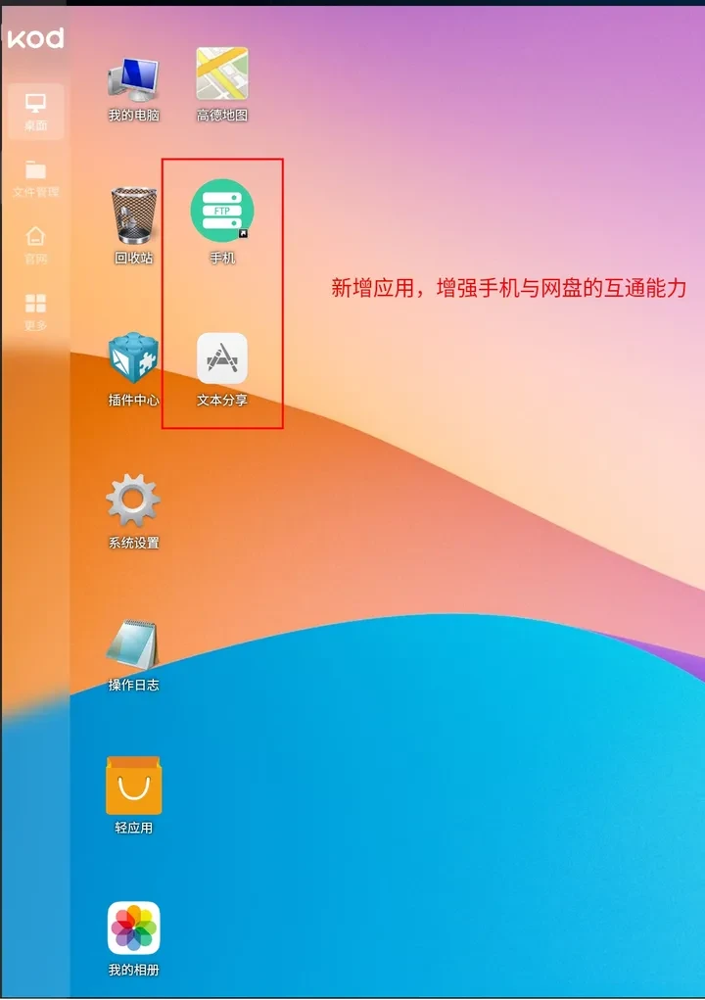

# CarryCloud
[**English**](README.md) | [**中文**](README.zh.md)

#### 简介
1.  app内置php环境，支持私人网盘系统kodbox或其他php应用，开箱即用
2.  拓展kbox原有功能，在PC浏览器管理网盘之外的手机文件
3.  新增一个文本分享的功能，在手机和PC之间免登录分享纯文本内容

#### 使用说明
1.  手机与PC连接同一局域网
2.  打开软件后保持前台
3.  根据提示在PC浏览器输入网址

#### 功能规划
1. [x]  扫码连接
2. [x]  公网访问

#### 截图展示

手机软件首页

文本分享手机端

文本分享PC端

手机文件管理

定制WebApp

